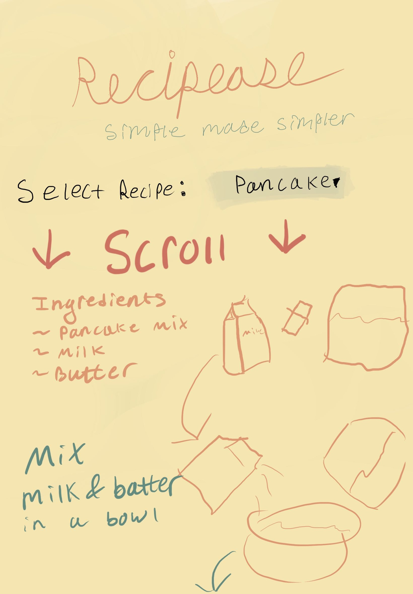
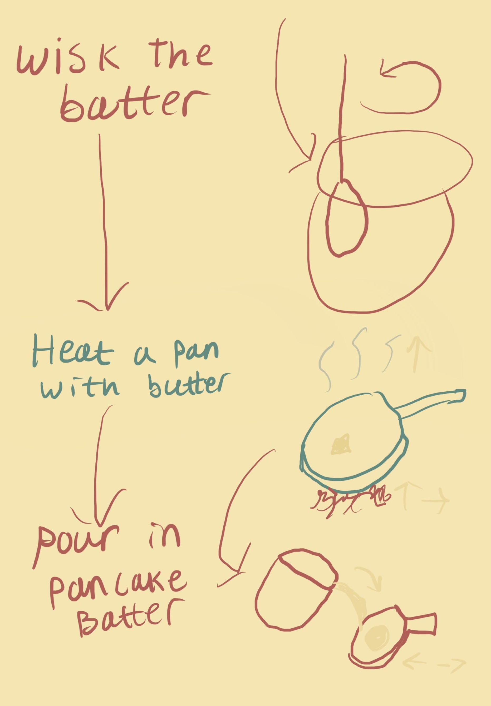
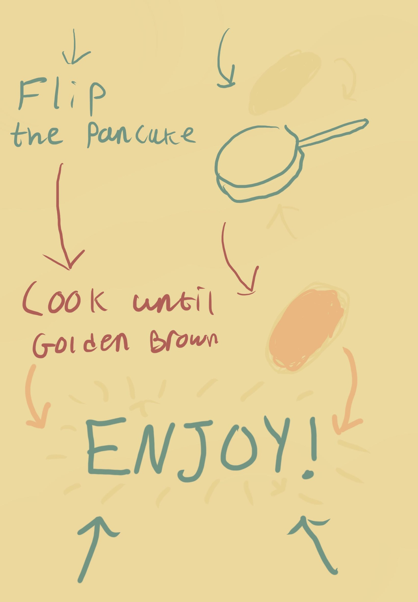

Mile Stone One:
--------------------------------
Overall description of the project:
    I would like to make a website that uses anime.js to illustrate recipes to a user through the use of scrolly-telling. The website would aim to make simple recipes even simpler, the intended audience would be children, or people that are very new to cooking and want to experiment with super easy recipes. One inspiration that I had for this project is Atmos, I really like how as you scroll the airplane flies through different facts.I thought that it was a super inventive way to format a website.

Wireframe that shows the design and flow of your site:
    my hand drawn sketches:
     
    
     

Description of how you intend to use JavaScript to significantly enhance the user experience of your website:
    Using Anime.js to make simple illustrations move as you scroll. This would require event listeners for scroll. I would also like to have a drop down to have users pick from a few different recipes.

Description of which new-to-you JavaScript library or 3rd party API you intend to you, and what you intend to use it for:
    Anime.js is the new-to-me library that I would like to use for this project and I intend on using it for animating shapes and images alongside scroll.

Any content or information sources you intend to draw upon, start thinking about them early and include them in the proposal if possible:
    Sources of information I might pull from are online recipes. I have not sorted out which recipes I am going to include yet, but I will cite any recipes that I use.

Describe or show how you intend to make the website responsive to different screen sizes and environments:
    I plan on using window.matchMedia() in the javascript, I will check if a window has been resized and if so I will resize the content. 

Your goals for the project should be split up by what you think are goals for:
    Prototyping/proof of concept:
        Drop down menue to select recipie as well as unanimated recipies layed out in scroll friendly format

    MVP (Minimum Viable Product):
        Three simple recepies, with abstracted illustration (2d primitive shapes)

    Stretch goals:
        Five recepies, More advanced illustrations such has custom drawings for each recipie

